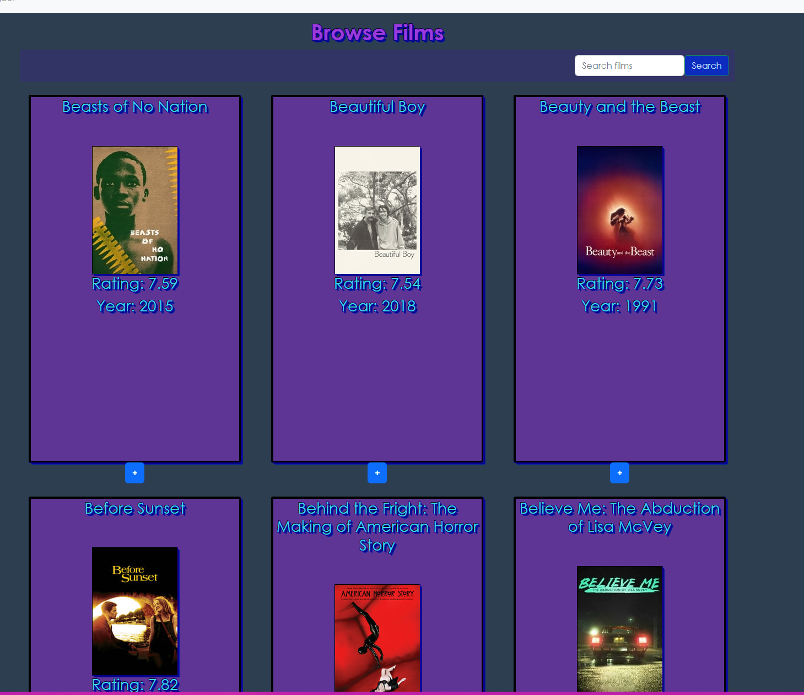
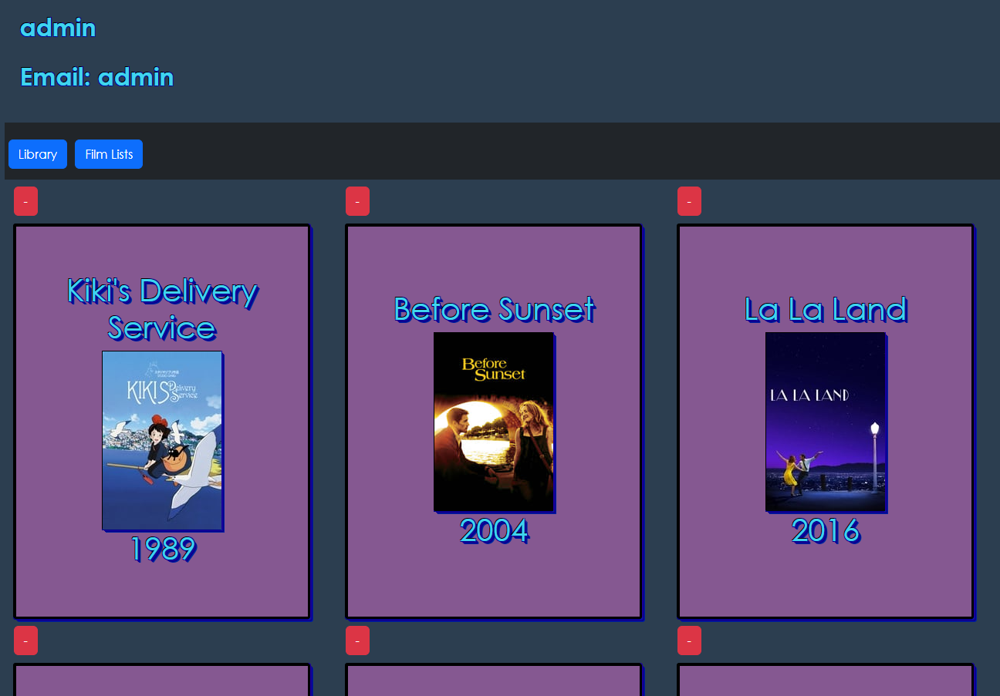
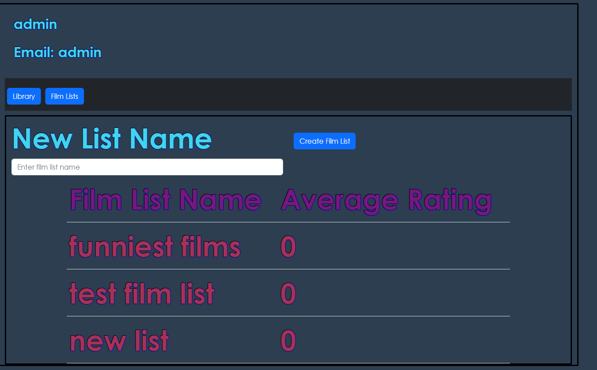
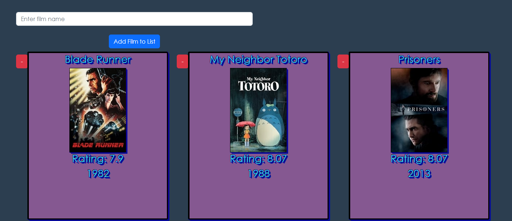
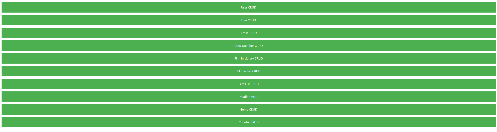

A website that allows users to log, review, rate, like movies, create film lists, search films and artists (actors, producers, directors etc.), see details of film (description, year, synopsis, cast and crew), see in which films an artist appears and their role. Also has an admin route for crud operations on all entities.

Technologies:
    - jwt for authorization and authentication
    - Back-end - Node.js/Express, postgresql
    - Front-end - Vue.js 2

Admin interface:

